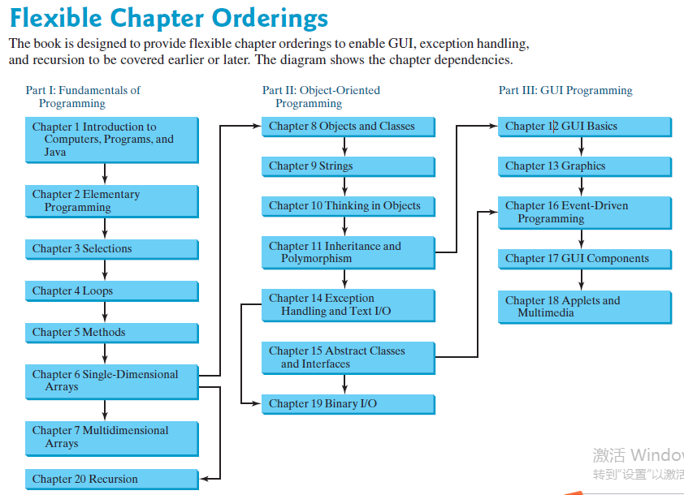

# Content

## Part I Fundamentals of Programming
1. Introduction to Computers, Programs,and Java
2. Elementary Programming
3. Selections（`if`,`switch`）
4. Loops(`while`, `do while`, `for`)
5. Methods
6. 
7. 

## Part II Object-Oriented Programming

## Part III GUI Programming

