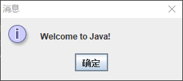

## Java, the World Wide Web, and Beyond

Java is a powerful and versatile programming language for developing software running on mobile devices, desktop computers, and servers.    

Java已经变得非常流行。 它的迅速发展和广泛接受可以追溯到其设计特征，尤其是它的承诺，即您可以编写一次程序并在任何地方运行。 正如其设计师所说，Java是简单，面向对象，分布式，解释，健壮，安全，体系结构中立，可移植，高性能，多线程和动态的。

## The Java Language Specification, API, JDK, and IDE

Java syntax is defined in the Java language specification, and the Java library is defined in the Java API. The JDK is the software for developing and running Java programs. An IDE is an integrated development environment for rapidly developing
programs.

## A Simple Java Program

A Java program is executed from the main method in the class.


`Program 1 输出一条信息`
```java
public class Main {

    public static void main(String[] args) {
	// write your code here
        System.out.println("Welcome to Java!");
    }
}
```

```
Welcome to Java!
```

1. 每个Java程序必须至少具有一个类。 每个类都有一个名称。 按照约定，类名以大写字母开头。 在此示例中，该类名字是`Main`。
2. 程序是从`main`方法执行的。 一个类可能包含几种方法。 `main`方法是程序开始执行的入口点。
3. `String`是一个编程术语，表示字符序列。`String`必须用双引号引起来。 Java中的每个语句都以分号`;`结尾。
4. 注释：单行注释`//`,多行注释`/* */`。

`Program 2 输出多条信息（Program 1 拓展）`
```java
public class Main {

    public static void main(String[] args) {
	// write your code here
        System.out.println("Programming is fun!");
        System.out.println("Fundamentals First");
        System.out.println("Problem Driven");
    }
}
```

```
Programming is fun!
Fundamentals First
Problem Driven
```

`Program 3 计算$\frac{10.5+2*3}{45-3.5}$`
```java
public class Main {

    public static void main(String[] args) {
	// write your code here
        System.out.println((10.5 + 2 * 3) / (45 - 3.5));
    }
}
```

```
0.39759036144578314
```

## Displaying Text in a Message Dialog Box

The program in `Program 1 `displays the text on the console. You can rewrite the program to display the text in a message dialog box. To do so, you need to use the `showMessageDialog` method in the `JOptionPane` class. `JOptionPane` is one of the many
predefined classes in the Java library that you can reuse rather than “reinvent the wheel.” You can use the `showMessageDialog` method to display any text in a message dialog box. 

`Program 4 窗口信息`
```java
import javax.swing.JOptionPane;

public class Main {

    public static void main(String[] args) {
	// write your code here
        JOptionPane.showMessageDialog(null,"Welcome to Java!");
    }
}
```

