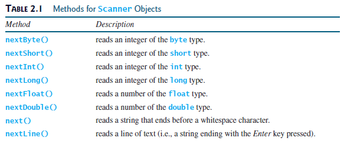
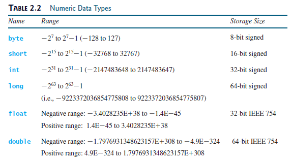
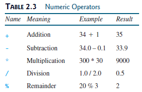
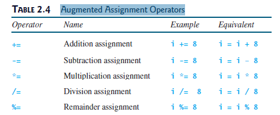
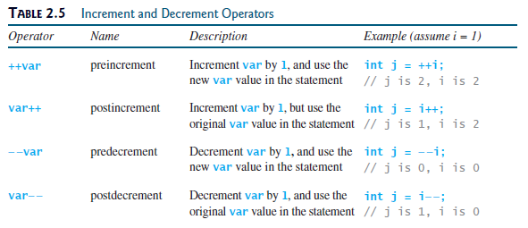
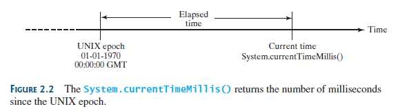
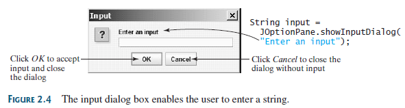
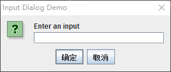

## Objectives（目标）
- To write Java programs to perform `simple computations` (§2.2).
- To `obtain input` from the console using the `Scanner` class (§2.3).
- To use `identifiers` to name variables, constants, methods, and classes (§2.4).
- To use variables to `store data` (§§2.5–2.6).
- To program with assignment statements and assignment expressions (§2.6).
- To use constants to store permanent data (§2.7).
- To name classes, methods, variables, and constants by following their
naming conventions (§2.8).
- To explore Java numeric primitive `data types`: `byte`, `short`, `int`, `long`,`float`, and `double` (§2.9.1).
- To perform operations using operators `+`, `-`,` *`, `/`, and `%` (§2.9.2).
- To perform exponent operations using `Math.pow(a, b)` (§2.9.3).
- To write integer literals, floating-point literals, and literals in scientific notation (§2.10).
- To write and evaluate numeric expressions (§2.11).
- To obtain the current system time using
`System.currentTimeMillis()` (§2.12).
- To use augmented assignment operators (§2.13).
- To distinguish between postincrement and preincrement and between
postdecrement and predecrement (§2.14).
- To cast the value of one type to another type (§2.15).
- To describe the software development process and apply it to develop the
loan payment program (§2.16).
- To represent characters using the `char` type (§2.17).
- To represent a string using the `String` type (§2.18).
- To obtain input using the `JOptionPane` input dialog boxes (§2.19).

## Writing a Simple Program

写一个程序首先需要设计解决问题的`策略`，然后才是使用编程语言实现这个策略。

#### 问题：计算圆的面积？

`算法` or `策略`:
1. 读圆的`半径`.
2. 按以下`公式`计算圆的面积:area=pi*r^2
3. `显示`结果.

`Program 1 计算圆的面积`
```java
        double radius; // Declare radius
        double area; // Declare area

        // Assign a radius
        radius = 20; // radius is now 20
        // Compute area
        area = radius * radius * 3.14159;

        // Display results
        System.out.println("The area for the circle of radius " +
                radius + " is " + area);
```

```
The area for the circle of radius 20.0 is 1256.636
```

## Reading Input from the Console
Reading input from the console enables the program to accept input from the user.



`Program 2 计算圆的面积(用户键盘输入)`
```java
import java.util.Scanner;

public class Main {

    public static void main(String[] args) {
        // Create a Scanner object
        Scanner input = new Scanner(System.in);

        // Prompt the user to enter a radius
        System.out.print("Enter a number for radius: ");
        double radius = input.nextDouble();

        // Compute area
        double area = radius * radius * 3.14159;

        // Display results
        System.out.println("The area for the circle of radius " +
                radius + " is " + area);
    }
}
```

```
Enter a number for radius: 20
The area for the circle of radius 20.0 is 1256.636
```

## Identifiers

标识符是在程序中用于区分诸如`类`、`方法`和`变量`等元素的名字。

- An identifier is a sequence of characters that consists of `letters`, `digits`, `underscores (_)`, and `dollar signs ($)`.
- An identifier must start with a letter, an underscore (_), or a dollar sign ($). It cannot start with a digit.
- An identifier cannot be a reserved word. (See Appendix A for a list of reserved words.)
- An identifier cannot be `true`, `false`, or `null`.
- An identifier can be of `any length.`
- Use lowercase for variables and methods. If a name consists of several words,concatenate them into one, making the first word lowercase and capitalizing the first letter of each subsequent word—for example, the variables `radius` and `area` and the method `showMessageDialog`.
- Capitalize the first letter of each word in a class name—for example, the class names `ComputeArea`, `System`, and `JOptionPane`.
- Capitalize every letter in a constant, and use underscores between words—for example, the constants `PI` and `MAX_VALUE`.

## Named Constants(符号常量)
A named constant is an identifier that represents a permanent value.

```java
final datatype CONSTANTNAME = value;
```

```
final double PI = 3.14159;
```

## Data Types(数据类型)






## Case Study: Displaying the Current Time


```java
        // Obtain the total milliseconds since midnight, Jan 1, 1970
        long totalMilliseconds = System.currentTimeMillis();

        // Obtain the total seconds since midnight, Jan 1, 1970
        long totalSeconds = totalMilliseconds / 1000;

        // Compute the current second in the minute in the hour
        long currentSecond = totalSeconds % 60;

        // Obtain the total minutes
        long totalMinutes = totalSeconds / 60;

        // Compute the current minute in the hour
        long currentMinute = totalMinutes % 60;

        // Obtain the total hours
        long totalHours = totalMinutes / 60;

        // Compute the current hour
        long currentHour = totalHours % 24;

        // Display results
        System.out.println("Current time is " + currentHour + ":"
                + currentMinute + ":" + currentSecond + " GMT");
        System.out.println("北京时间： " + (currentHour+8) + ":"
                + currentMinute + ":" + currentSecond);
```

```
Current time is 0:51:8 GMT
北京时间： 8:51:8
```

## Getting Input from Input Dialogs
An input dialog box prompts the user to enter an input graphically.



`Program 3 窗口输入`
```java
        JOptionPane.showInputDialog(null,
                "Enter an input",
                "Input Dialog Demo",
                JOptionPane.QUESTION_MESSAGE);
```




`Program 4 窗口输入String 转换为int或double`
```java
        // Enter annual interest rate
        String annualInterestRateString = JOptionPane.showInputDialog(
                "Enter annual interest rate, for example, 8.25:");

        // Convert string to double
        double annualInterestRate =
                Double.parseDouble(annualInterestRateString);

        // Obtain monthly interest rate
        double monthlyInterestRate = annualInterestRate / 1200;

        // Enter number of years
        String numberOfYearsString = JOptionPane.showInputDialog(
                "Enter number of years as an integer, for example, 5:");

        // Convert string to int
        int numberOfYears = Integer.parseInt(numberOfYearsString);

        // Enter loan amount
        String loanString = JOptionPane.showInputDialog(
                "Enter loan amount, for example, 120000.95:");

        // Convert string to double
        double loanAmount = Double.parseDouble(loanString);

        // Calculate payment
        double monthlyPayment = loanAmount * monthlyInterestRate / (1
                - 1 / Math.pow(1 + monthlyInterestRate, numberOfYears * 12));
        double totalPayment = monthlyPayment * numberOfYears * 12;

        // Format to keep two digits after the decimal point
        monthlyPayment = (int)(monthlyPayment * 100) / 100.0;
        totalPayment = (int)(totalPayment * 100) / 100.0;

        // Display results
        String output = "The monthly payment is $" + monthlyPayment +"\nThe total payment is $" + totalPayment;
        JOptionPane.showMessageDialog(null, output);
```