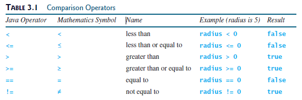
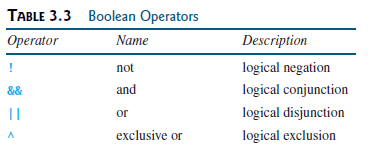
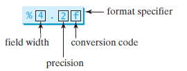
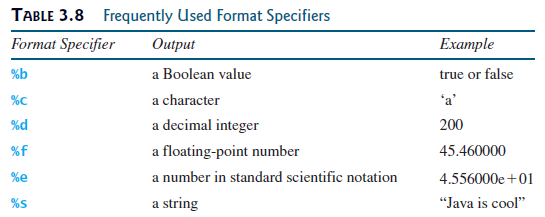
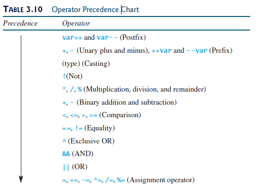
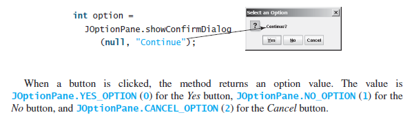

## Objectives

- To declare `boolean` variables and write Boolean expressions using comparison operators (§3.2).
- To implement selection control using one-way `if` statements (§3.3).
- To program using one-way `if` statements (`GuessBirthday`) (§3.4).
- To implement selection control using two-way `if-else` statements
(§3.5).
- To implement selection control using nested` if `and multi-way `if` statements (§3.6).
- To avoid common errors in `if` statements (§3.7).
- To generate random numbers using the `Math.random()` method (§3.8).
- To program using selection statements for a variety of examples
(`SubtractionQuiz`, `BMI`, `ComputeTax`) (§§3.8–3.10).
- To combine conditions using logical operators (`&&`, `||`, and `!`) (§3.11).
- To program using selection statements with combined conditions
(`LeapYear`, `Lottery`) (§§3.12–3.13).
- To implement selection control using `switch` statements (§3.14).
- To write expressions using the conditional operator (§3.15).
- To format output using the `System.out.printf` method (§3.16).
- To examine the rules governing operator precedence and associativity
(§3.17).
- To get user confirmation using confirmation dialogs (§3.18).
- To apply common techniques to debug errors (§3.19).

## Simple example
```java
        double radius=5; // Declare radius
        double area; // Declare area

        if (radius < 0) {
            System.out.println("Incorrect input");
        }
        else {
            area = radius * radius * 3.14159;
            System.out.println("Area is " + area);
        }
```

## boolean Data Type and logical operators



## `if` statement
```java
        if (radius < 0) {
            System.out.println("Incorrect input");
        }
```

## Two-Way `if-else` Statements
```java
        if (boolean-expression) {
            statement(s)-for-the-true-case;
        }
        else {
            statement(s)-for-the-false-case;
        }
```

## Nested if and Multi-Way if-else Statements
```java
        if (i > k) {
            if (j > k)
            System.out.println("i and j are greater than k");
        }
        else
            System.out.println("i is less than or equal to k");
```

## Generating Random Numbers
You can use `Math.random()` to obtain a random double value between `0.0` and `1.0`, excluding `1.0`.

## switch Statements
```java
        switch (status) {
            case 0: compute tax for single filers;
                    break;
            case 1: compute tax for married jointly or qualifying widow(er);
                    break;
            case 2: compute tax for married filing separately;
                    break;
            case 3: compute tax for head of household;
                    break;
            default: System.out.println("Error: invalid status");
            System.exit(1);
        }
```

## Conditional Expressions
```java
        if (x > 0)
        y = 1;
        else
        y = -1;
```

```java
        y = (x > 0) ? 1 : -1;
```

## Formatting Console Output
You can use the `System.out.printf` method to display formatted output on the console.

`原`
```java
        double amount = 12618.98;
        double interestRate = 0.0013;
        double interest = amount * interestRate;
        System.out.println("Interest is "
                + (int)(interest * 100) / 100.0);
```

`格式化输出`
```java
        System.out.printf("Interest is %4.2f", interest);
```




## Operator Precedence and Associativity
Operator precedence and associativity determine the order in which operators are evaluated.




## Confirmation Dialogs
You can use a confirmation dialog to obtain a confirmation from the user.


