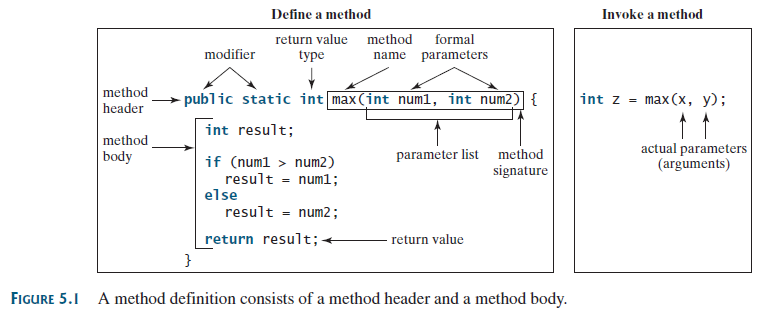
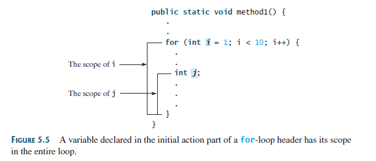
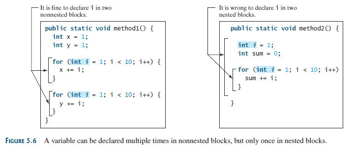

## Objectives

- To define methods with formal parameters (§5.2).
- To invoke methods with actual parameters (i.e., arguments) (§5.2).
- To define methods with a return value (§5.3).
- To define methods without a return value (§5.4).
- To pass arguments by value (§5.5).
- To develop reusable code that is modular, easy to read, easy to debug, and easy to maintain (§5.6).
- To write a method that converts decimals to hexadecimals (§5.7).
- To use method overloading and understand ambiguous overloading (§5.8).
- To determine the scope of variables (§5.9).
- To solve mathematics problems using the methods in the Math class (§§5.10–5.11).
- To apply the concept of method abstraction in software development (§5.12).
- To design and implement methods using stepwise refinement (§5.12).

## A simple example 

```java
    public static int sum(int i1, int i2) {
        int result = 0;
        for (int i = i1; i <= i2; i++)
            result += i;

        return result;
    }
    public static void main(String[] args) {
	// write your code here
        System.out.println("Sum from 1 to 10 is " + sum(1, 10));
        System.out.println("Sum from 20 to 37 is " + sum(20, 37));
        System.out.println("Sum from 35 to 49 is " + sum(35, 49));
    }
```

## 定义一个方法（method）

```java
modifier returnValueType methodName(list of parameters) {
// Method body;
}
```


The `static` modifier is used for all the methods in this chapter.

### void Method 
A `void` method does not return a value.

```java
public static void printGrade(double score){
// Method body;
}
```

### Overloading Methods

Overloading methods enables you to define the methods with the same name as long as their `signatures` are different.

## 变量的作用域




## The Math Class
The `Math` class contains the methods needed to perform basic mathematical functions.

1. 三角函数方法（sin,cos）;
2. 指数方法（pow, log）;
3. 取整方法(ceil, floor);
4. The `min`, `max`, and `abs` Methods
5. The random Method

## Method Abstraction and Stepwise Refinement(这里以后可以仔细看看，讲的是构建的思想)