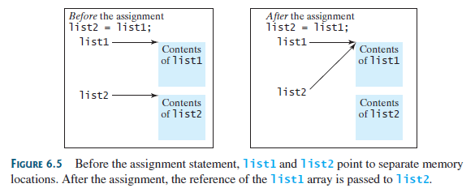
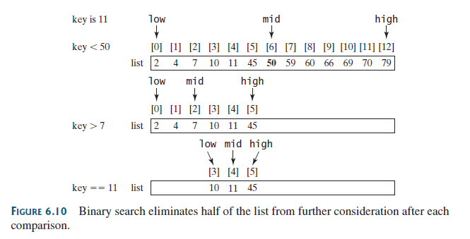
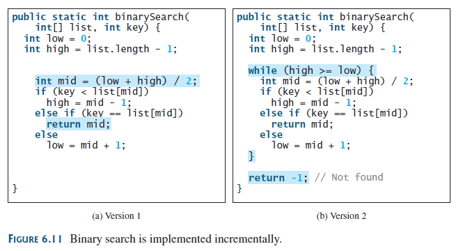

## Objectives
- To describe why arrays are necessary in programming (§6.1).
- To declare array reference variables and create arrays (§§6.2.1–6.2.2).
- To obtain array size using `arrayRefVar`.`length` and know default values in an array (§6.2.3).
- To access array elements using indexed variables (§6.2.4).
- To declare, create, and initialize an array using an array initializer (§6.2.5).
- To program common array operations (displaying arrays, summing all elements, finding the minimum and maximum elements, random shuffling, and shifting elements) (§6.2.6).
- To simplify programming using the for-each loops (§6.2.7).
- To apply arrays in application development (`LottoNumbers`,
`DeckOfCards`) (§§6.3–6.4).
- To copy contents from one array to another (§6.5).
- To develop and invoke methods with array arguments and return values (§§6.6–6.8).
- To define a method with a variable-length argument list (§6.9).
- To search elements using the linear (§6.10.1) or binary (§6.10.2) search algorithm.
- To sort an array using the selection sort approach (§6.11.1).
- To sort an array using the insertion sort approach (§6.11.2).
- To use the methods in the `java.util.Arrays` class (§6.12).

## A simple example
A single array variable can reference a large collection of data.

```java
1 public class AnalyzeNumbers {
2 public static void main(String[] args) {
3 final int NUMBER_OF_ELEMENTS = 100;
4
5 double sum = 0;
6
7 java.util.Scanner input = new java.util.Scanner(System.in);
8 for (int i = 0; i < NUMBER_OF_ELEMENTS; i++) {
9 System.out.print("Enter a new number: ");
10
11 sum += numbers[i];
12 }
13
14 double average = sum / NUMBER_OF_ELEMENTS;
15
16 int count = 0; // The number of elements above average
17 for (int i = 0; i < NUMBER_OF_ELEMENTS; i++)
18 if (numbers[i] > average)
19 count++;
20
21 System.out.println("Average is " + average);
22 System.out.println("Number of elements above the average "
23 + count);
24 }
25 }
```

## Array Basics
Once an array is created, **its size is fixed**. An array reference variable is used to access the elements in an array using an index.

### Declaring Array Variables
```java
elementType[] arrayRefVar;
```
The` elementType` can be any data type, and all elements in the array will have the same data type.

### Creating Arrays
```java
elementType[] arrayRefVar = new elementType[arraySize];
```
or
```java
elementType arrayRefVar = new elementType[arraySize];
```

### Array Initializers
```java
elementType[] arrayRefVar = {value0, value1, ..., valuek};
```

```java
double[] myList = {1.9, 2.9, 3.4, 3.5};
```

### for-each Loops
Java supports a convenient `for` loop, known as a `for-each` loop or enhanced for loop, which enables you to traverse the array sequentially without using an index variable. For example,the following code displays all the elements in the array `myList`:

```java
for (double u: myList) {
    System.out.println(u);
}
```

## Copying Arrays
To copy the contents of one array into another, you have to copy the array’s individual elements into the other array.



上图使用`=`会是的两个数组变量指向同一内存地址。为了指向不同地址，可以采用以下三种方法。

There are three ways to copy arrays:
- Use a loop to copy individual elements one by one.
- Use the static `arraycopy` method in the `System` class.
- Use the `clone` method to copy arrays; this will be introduced in Chapter 15, Abstract Classes and Interfaces.

`Program 1 Loop method`
```java
        int[] sourceArray = {2, 3, 1, 5, 10};
        int[] targetArray = new int[sourceArray.length];
        for (int i = 0; i < sourceArray.length; i++) {
            targetArray[i] = sourceArray[i];
        }
```


`Program 2 arraycopy method`

```java
arraycopy(sourceArray, src_pos, targetArray, tar_pos, length);
```

The parameters `src_pos` and `tar_pos` indicate the starting positions in `sourceArray` and `targetArray`, respectively. The number of elements copied from `sourceArray` to `targetArray` is indicated by `length`. For example, you can rewrite the loop using the following statement:

```java
System.arraycopy(sourceArray, 0, targetArray, 0, sourceArray.length);
```

## Passing Arrays to Methods
When passing an array to a method, the reference of the array is passed to the method.

```java

        int x = 1; // x represents an int value
        int[] y = new int[10]; // y represents an array of int values

        m(x, y); // Invoke m with arguments x and y

        System.out.println("x is " + x);
        System.out.println("y[0] is " + y[0]);

   public static void m(int number, int[] numbers) {
        number = 1001; // Assign a new value to number
        numbers[0] = 5555; // Assign a new value to numbers[0]
    }
```

## Returning an Array from a Method
When a method returns an array, the reference of the array is returned.

```java
        int[] list1 = {1, 2, 3, 4, 5, 6};
        int[] list2 = reverse(list1);
        System.out.println(Arrays.toString(list1));
        System.out.println(Arrays.toString(list2));

    public static int[] reverse(int[] list) {
        int[] result = new int[list.length];

        for (int i = 0, j = result.length - 1;
             i < list.length; i++, j--) {
            result[j] = list[i];
        }

        return result;
    }
```

```java
[1, 2, 3, 4, 5, 6]
[6, 5, 4, 3, 2, 1]
```

## Variable-Length Argument Lists(变长度参数列表)
A variable number of arguments of the same type can be passed to a method and treated as an array.

```java
        printMax(34, 3, 3, 2, 56.5);
        printMax(new double[]{1, 2, 3});

    public static void printMax( double... numbers ) {
        if (numbers.length == 0) {
            System.out.println("No argument passed");
            return;
        }

        double result = numbers[0];

        for (int i = 1; i < numbers.length; i++)
            if (numbers[i] > result)
            result = numbers[i];

        System.out.println("The max value is " + result);
    }
```

```java
The max value is 56.5
The max value is 3.0
```

## Searching Arrays
If an array is sorted, binary search is more efficient than linear search for finding an element in the array.

### The Linear Search Approach

```java
        int[] list = {1, 4, 4, 2, 5, -3, 6, 2};
        int i = linearSearch(list, 4); // Returns 1
        int j = linearSearch(list, -4); // Returns -1
        int k = linearSearch(list, -3); // Returns 5

        System.out.println(i);
        System.out.println(j);
        System.out.println(k);

    public static int linearSearch(int[] list, int key) {
    for (int i = 0; i < list.length; i++) {
        if (key == list[i])
            return i;
        }
    return -1;
    }
```

```java
1
-1
5
```

## The Binary Search Approach
Binary search is the other common search approach for a list of values. For binary search to work, the elements in the array must already be ordered.




## Sorting Arrays
There are many strategies for sorting elements in an array. Selection sort and insertion sort are two common approaches.

## The Arrays Class
The `java.util.Arrays` class contains useful methods for common array operations such as sorting and searching.

The `java.util.Arrays` class contains various static methods for sorting and searching arrays, comparing arrays, filling array elements, and returning a string representation of the array. These methods are overloaded for all primitive types.
